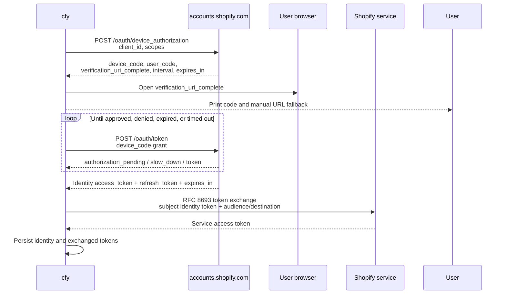
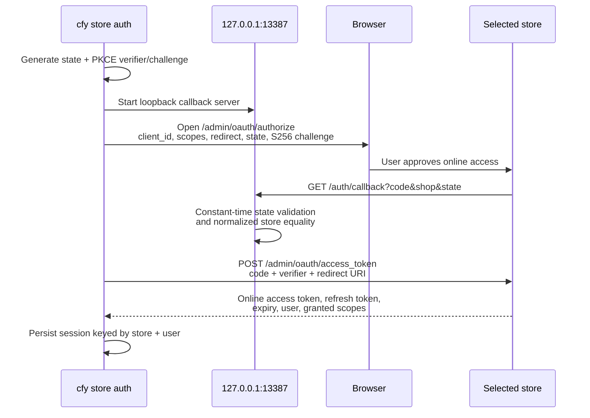

# Shopify CLI authentication research

- Status: implementation input for issue #15
- Upstream repository: [`Shopify/cli`](https://github.com/Shopify/cli)
- Pinned commit: [`87a3ae19c8ddc6bdb379d9d69068ad986995aa59`](https://github.com/Shopify/cli/tree/87a3ae19c8ddc6bdb379d9d69068ad986995aa59)
- Snapshot version recorded by the inventory: Shopify CLI 4.6.0

This document describes observed behavior, not a promise from Shopify. Publicly documented mechanisms are distinguished from Shopify CLI's private service contracts.

## Executive decision

Catify should treat Shopify authentication as two separate stacks:

1. **Developer identity authentication** for app, theme, organization, and Partner/Dev Dashboard workflows. This uses OAuth 2.0 Device Authorization against Shopify Identity, followed by token exchange for service-specific audiences.
2. **Direct store authentication** for `store auth` commands. This uses authorization code + PKCE against a selected store, a loopback callback, and online Admin API access and refresh tokens.

Issue #15 should implement the developer identity stack first. Direct store authentication should remain a separate adapter/module because its client ID, endpoints, token schema, scopes, storage key, refresh behavior, and browser callback differ.

Internal Shopify services must sit behind versioned traits so an upstream contract change does not spread through command code.

## 1. Developer identity flow

### Interactive browser/device flow

Observed source:

- [`packages/cli-kit/src/private/node/session.ts`](https://github.com/Shopify/cli/blob/87a3ae19c8ddc6bdb379d9d69068ad986995aa59/packages/cli-kit/src/private/node/session.ts)
- [`packages/cli-kit/src/private/node/session/device-authorization.ts`](https://github.com/Shopify/cli/blob/87a3ae19c8ddc6bdb379d9d69068ad986995aa59/packages/cli-kit/src/private/node/session/device-authorization.ts)
- [`packages/cli-kit/src/private/node/session/identity.ts`](https://github.com/Shopify/cli/blob/87a3ae19c8ddc6bdb379d9d69068ad986995aa59/packages/cli-kit/src/private/node/session/identity.ts)



Endpoints and parameters at the pinned commit:

| Purpose | Endpoint | Important fields |
| --- | --- | --- |
| Device authorization | `https://accounts.shopify.com/oauth/device_authorization` | `client_id`, space-delimited `scope` |
| Device token polling | `https://accounts.shopify.com/oauth/token` | `grant_type=urn:ietf:params:oauth:grant-type:device_code`, `device_code`, `client_id` |
| Identity refresh | `https://accounts.shopify.com/oauth/token` | `grant_type=refresh_token`, `access_token`, `refresh_token`, `client_id` |
| Service token exchange | Identity `/oauth/token` | RFC 8693 token-exchange grant, `subject_token`, `subject_token_type`, `requested_token_type`, optional `audience` or `destination` |

Polling behavior:

- Starts with the server-provided interval, defaulting to five seconds.
- Adds five seconds after `slow_down`.
- Continues on `authorization_pending`.
- Stops on denial, expiry, unknown errors, or after ten minutes.
- Opens the complete verification URL. If browser launch fails, the URL and user code remain usable manually.

### Scope composition

Observed source: [`packages/cli-kit/src/private/node/session/scopes.ts`](https://github.com/Shopify/cli/blob/87a3ae19c8ddc6bdb379d9d69068ad986995aa59/packages/cli-kit/src/private/node/session/scopes.ts).

Identity scopes always include:

- `openid`
- `https://api.shopify.com/auth/shop.admin.graphql`
- `https://api.shopify.com/auth/shop.admin.themes`
- `https://api.shopify.com/auth/partners.collaborator-relationships.readonly`
- `https://api.shopify.com/auth/shop.storefront-renderer.devtools`
- `https://api.shopify.com/auth/partners.app.cli.access`
- `https://api.shopify.com/auth/destinations.readonly`
- `https://api.shopify.com/auth/organization.store-management`
- `https://api.shopify.com/auth/organization.on-demand-user-access`
- `https://api.shopify.com/auth/organization.apps.manage`

The list above was revalidated against the installed Shopify CLI 4.6.1 runtime
and a successful production device-authorization handshake on 2026-09-01.

Callers can append additional scopes. The upstream validation accepts a stored identity token only when every requested scope is present.

### Token audiences and exchange results

Observed source: [`packages/cli-kit/src/private/node/session/exchange.ts`](https://github.com/Shopify/cli/blob/87a3ae19c8ddc6bdb379d9d69068ad986995aa59/packages/cli-kit/src/private/node/session/exchange.ts).

| Result | Exchange selector | Usage |
| --- | --- | --- |
| Partners token | `audience=https://partners.shopify.com/...` | Legacy Partner Dashboard GraphQL |
| Storefront-renderer token | `audience=https://{store}/admin/api` | Theme/storefront rendering workflows |
| Store Admin token | `destination=https://{store}/admin` | Store Admin API workflows |
| Business Platform token | `audience=https://destinations.shopifysvc.com/destinations/api` | Organizations and destinations |
| Business Platform Organizations token | `audience=https://destinations.shopifysvc.com/organizations/api` | Organization-owned store management |
| App Management token | `audience=https://app.shopify.com/app-management` | Dev Dashboard app management |

The Identity token response contains an access token, refresh token, granted scope string, and expiry. Exchanged service tokens have their own expiry but no independently observed refresh token; upstream refreshes identity first when necessary and exchanges again.

### Expiration and refresh

Observed source:

- [`packages/cli-kit/src/private/node/session/validate.ts`](https://github.com/Shopify/cli/blob/87a3ae19c8ddc6bdb379d9d69068ad986995aa59/packages/cli-kit/src/private/node/session/validate.ts)
- [`packages/cli-kit/src/private/node/session.ts`](https://github.com/Shopify/cli/blob/87a3ae19c8ddc6bdb379d9d69068ad986995aa59/packages/cli-kit/src/private/node/session.ts)

Upstream considers a token expired four minutes before its stated expiry. Recommended Catify behavior:

1. Resolve credentials from approved environment overrides before disk.
2. Validate identity scopes and expiry with the same four-minute safety margin.
3. Refresh the Identity token if expired and a refresh token exists.
4. Re-exchange only missing or expired service audiences.
5. Persist a complete replacement record atomically after all required exchanges succeed.
6. On invalid refresh credentials, remove the affected local identity session and request login.

### Logout and revocation

`shopify auth logout` removes local Identity sessions. No remote revocation request was found in the pinned implementation. Therefore Catify must not claim that logout revokes tokens server-side.

Proposed user wording: **“Removed local Shopify credentials. Tokens might remain valid until expiration or server-side revocation.”**

## 2. Direct store OAuth flow

Observed source:

- [`packages/store/src/cli/services/store/auth/index.ts`](https://github.com/Shopify/cli/blob/87a3ae19c8ddc6bdb379d9d69068ad986995aa59/packages/store/src/cli/services/store/auth/index.ts)
- [`packages/store/src/cli/services/store/auth/pkce.ts`](https://github.com/Shopify/cli/blob/87a3ae19c8ddc6bdb379d9d69068ad986995aa59/packages/store/src/cli/services/store/auth/pkce.ts)
- [`packages/store/src/cli/services/store/auth/callback.ts`](https://github.com/Shopify/cli/blob/87a3ae19c8ddc6bdb379d9d69068ad986995aa59/packages/store/src/cli/services/store/auth/callback.ts)
- [`packages/store/src/cli/services/store/auth/token-client.ts`](https://github.com/Shopify/cli/blob/87a3ae19c8ddc6bdb379d9d69068ad986995aa59/packages/store/src/cli/services/store/auth/token-client.ts)



Fixed behavior at the pinned commit:

- Loopback address: `127.0.0.1`.
- Port: `13387`.
- Callback path: `/auth/callback`.
- Callback timeout: five minutes.
- Authorization endpoint: `https://{store}/admin/oauth/authorize`.
- Token and refresh endpoint: `https://{store}/admin/oauth/access_token`.
- PKCE method: `S256`.
- Callback checks `shop`, constant-time `state`, OAuth error, and authorization code.
- If opening a browser fails, the CLI prints the authorization URL.
- Refresh is attempted four minutes before expiry; failed refresh removes the stored session and asks the user to authenticate again.

This stack returns an **online** Admin API token associated with a user. It must not be substituted for the developer Identity token.

## 3. Headless and non-interactive operation

### CI behavior

The Identity device flow aborts when CI is detected. It does not wait forever for browser approval. The supported automation path is an App Automation Token in:

- `SHOPIFY_APP_AUTOMATION_TOKEN`
- Deprecated fallback: `SHOPIFY_CLI_PARTNERS_TOKEN`

App Automation Tokens are publicly documented for CI deployments: [Manage App Automation Tokens](https://shopify.dev/docs/apps/build/dev-dashboard/app-automation-tokens).

Upstream exchanges the automation token into service-specific tokens and ignores requested interactive scopes. Catify should:

- Never write automation tokens to disk.
- Mark the environment source as non-refreshable.
- Reject commands whose required service/audience cannot be obtained from that token.
- Never include token values in debug output, request errors, URLs, panic reports, or telemetry.

### `--non-interactive`

If valid cached credentials already satisfy the request, commands can proceed. If login, organization selection, store selection, or additional consent is required, fail with a typed interaction-required error and actionable flags/environment variables. Do not silently choose the first organization/store.

### Remote/headless browser environments

For interactive device authorization, always print the user code and verification URL before attempting browser launch. Device flow does not require a local callback listener and is suitable over SSH.

Direct `store auth` currently requires a loopback callback. Before implementing it, validate whether Shopify accepts alternate loopback ports or an out-of-band recovery path. Until then, fail clearly on remote machines that cannot expose the browser's loopback request to the CLI host.

## 4. Credential storage requirements

The pinned Shopify CLI stores sessions through a `conf`-backed JSON configuration store. No OS keychain/keyring integration or application-level encryption was found in the reviewed session store. That behavior is compatible but not a security target for Catify.

Catify requirements:

1. Define a `CredentialStore` trait independent from config storage.
2. Prefer native secure storage:
   - macOS Keychain
   - Windows Credential Manager
   - Linux Secret Service
3. Provide an explicit file fallback only when secure storage is unavailable. The fallback must use owner-only permissions, atomic writes, and a warning identifying the reduced protection.
4. Store metadata separately from secret material where practical.
5. Key Identity sessions by account identity/alias and store sessions by normalized store plus user ID.
6. Never persist environment-provided automation or theme tokens.
7. Redact access tokens, refresh tokens, device codes, authorization codes, PKCE verifiers, and OAuth query parameters.

A migration importer from Shopify CLI storage is optional and must be opt-in. It should copy credentials into Catify storage rather than continuing to share a mutable file.

## 5. Organization and store selection

The pinned CLI uses multiple backends:

| Workflow | Observed backend | Token |
| --- | --- | --- |
| Dev Dashboard organization lookup | `@shopify/organizations` and App Management client | App Management/Identity-derived token |
| Legacy Partner organization/app lookup | `partners.shopify.com` GraphQL | Partners token |
| Organization destinations | `destinations.shopifysvc.com/destinations/api/graphql` | Business Platform token |
| Organization-owned stores | `destinations.shopifysvc.com/organizations/api/graphql` | Business Platform Organizations token |
| Direct store commands | `{store}/admin/api/{version}/graphql.json` | Store OAuth online access token |

Representative internal queries:

- `currentUserAccount.organization(id: ...)` for organization resolution.
- `organization.accessibleShops(...)` for active organization-owned stores.
- `currentUserAccount`/organization package calls for organization listing and access metadata.

Selection contract for Catify:

- Normalize explicit organization and store identifiers before network access.
- In interactive mode, prompt when multiple valid choices exist.
- In non-interactive mode, require a unique config/env/flag value.
- Cache only non-secret IDs and display names; revalidate authorization at command execution.
- Keep legacy Partner and newer Dev Dashboard clients as separate implementations behind a shared trait.

## 6. Public versus internal risk matrix

| Contract | Status | Risk | Mitigation |
| --- | --- | --- | --- |
| OAuth 2.0 Device Authorization semantics | Open standard | Low | Implement RFC behavior and mock-server conformance tests. |
| OAuth 2.0 token exchange semantics | Open standard | Low | Implement RFC 8693 encoding independently. |
| App Automation Token environment variable and deployment use | Public Shopify documentation | Low | Treat as supported automation credential; test documented use cases. |
| Store authorization-code OAuth and Admin token endpoint | Public Shopify OAuth family, CLI-specific client behavior | Medium | Use strict PKCE/state validation; verify the CLI client is permitted for third-party implementations before release. |
| Embedded Identity client ID and Store Auth client ID | Source-visible but controlled by Shopify | High | Do not assume redistribution permission. Obtain approval or require user-provided/registered client configuration. |
| Identity scope list | Source-visible, not a stable public CLI API | High | Centralize scopes in a versioned capability table and request minimum necessary scopes. |
| Shopify Identity endpoint paths and response extensions | Source-visible/private CLI contract | High | Isolate in `IdentityProvider`; fixture-test and fail with upgrade guidance. |
| Partners token exchange audience | Private service contract | High | Adapter with contract tests and feature guard. |
| Business Platform endpoints and GraphQL schema | Internal Shopify service | Critical | No stable-API claim; isolate, telemetry-free by default, and gate production use on live compatibility tests. |
| App Management endpoint/schema | Internal Shopify service | Critical | Version adapter and preserve official CLI fallback instructions. |
| `@shopify/organizations` behavior | Published package but Shopify-controlled CLI contract | High | Capture observed request fixtures; avoid binding domain models directly to package schema. |
| Local Shopify CLI session JSON format | Implementation detail | High | Optional one-way importer only; never use it as Catify's canonical store. |

## 7. Unknowns and executable investigation plan

These questions require live Shopify credentials, Shopify approval, or legal/product confirmation and are intentionally not guessed.

### A. Can Catify legally and operationally use Shopify CLI's OAuth client IDs?

1. Ask Shopify Developer Relations/security for explicit third-party native CLI usage terms.
2. Search repository license notices and Shopify developer terms for OAuth client restrictions.
3. Do not ship interactive auth publicly until answered.
4. Preferred resolution: Shopify registers Catify as an approved public native client with least-privilege scopes.

### B. Are internal exchange audiences available to a separately registered client?

With a disposable partner account and development app:

1. Request Identity device authorization using the approved Catify client.
2. Exchange for each audience independently.
3. Record only status, response shape, granted scopes, and request ID; never record tokens.
4. Classify unsupported audiences and map commands to official Shopify CLI fallback.

### C. Organization API schema stability

1. Capture sanitized request/response fixtures from official Shopify CLI at this pinned commit.
2. Repeat against the latest Shopify CLI release.
3. Diff operation names, variables, IDs, pagination, and error codes.
4. Add a scheduled compatibility probe using a dedicated test organization if Shopify permits it.

### D. Revocation semantics

1. Confirm whether Identity exposes a supported revocation endpoint for this client.
2. Confirm whether direct store online tokens can be revoked by token endpoint or only app uninstall/session invalidation.
3. Until documented, implement local deletion only and state that accurately.

### E. Loopback callback portability

Test direct store OAuth on:

- macOS, Windows, and Linux desktop browsers.
- WSL2.
- SSH with browser on a different machine.
- Containers and Codespaces.
- Port `13387` occupied.

Verify whether Shopify accepts another loopback port and whether the redirect URI is pre-registered exactly or by loopback class.

### F. Account aliases and multi-account behavior

1. Login with two Shopify accounts.
2. Validate alias selection, stale alias cleanup, last-seen user behavior, and logout isolation.
3. Specify deterministic non-interactive selection rules before implementing account switching.

## 8. Proposed issue #15 implementation boundaries

Recommended modules:

```text
cfy-auth
├── identity.rs          # device authorization and identity refresh
├── exchange.rs          # service audience token exchange
├── credentials.rs       # secure-store trait and platform implementations
├── session.rs           # expiry, scope, alias, and cache orchestration
├── automation.rs        # environment-only App Automation Tokens
├── browser.rs           # open URL plus manual fallback
└── provider.rs          # versioned Shopify endpoint/capability contract
```

Initial acceptance extension for #15:

- Mock-server tests for pending, slow-down, denied, expired, timeout, refresh, and malformed token responses.
- Four-minute expiry margin covered by a fake clock.
- Concurrent refresh deduplication so parallel commands do not rotate the same refresh token twice.
- Secure-store mock tests for locked, unavailable, corrupt, and permission-denied backends.
- Environment automation tokens proven absent from persisted data and diagnostics.
- Logout wording and behavior tested as local deletion, not remote revocation.
- Internal audience adapters disabled by a clear compatibility error when an endpoint contract is unknown.

## 9. Sources

Primary source is Shopify CLI at commit [`87a3ae19c8ddc6bdb379d9d69068ad986995aa59`](https://github.com/Shopify/cli/tree/87a3ae19c8ddc6bdb379d9d69068ad986995aa59), especially:

- `packages/cli-kit/src/private/node/session.ts`
- `packages/cli-kit/src/private/node/session/device-authorization.ts`
- `packages/cli-kit/src/private/node/session/identity.ts`
- `packages/cli-kit/src/private/node/session/exchange.ts`
- `packages/cli-kit/src/private/node/session/store.ts`
- `packages/cli-kit/src/private/node/session/scopes.ts`
- `packages/cli-kit/src/private/node/session/validate.ts`
- `packages/cli-kit/src/public/node/store-auth-session.ts`
- `packages/store/src/cli/services/store/auth/*`
- `packages/cli-kit/src/public/node/api/business-platform*.ts`
- `packages/app/src/cli/utilities/developer-platform-client/app-management-client.ts`

Public Shopify documentation:

- [Manage App Automation Tokens](https://shopify.dev/docs/apps/build/dev-dashboard/app-automation-tokens)
- [Authorization code grant](https://shopify.dev/docs/apps/build/authentication-authorization/access-tokens/authorization-code-grant)
- [Token exchange](https://shopify.dev/docs/apps/build/authentication-authorization/access-tokens/token-exchange)
